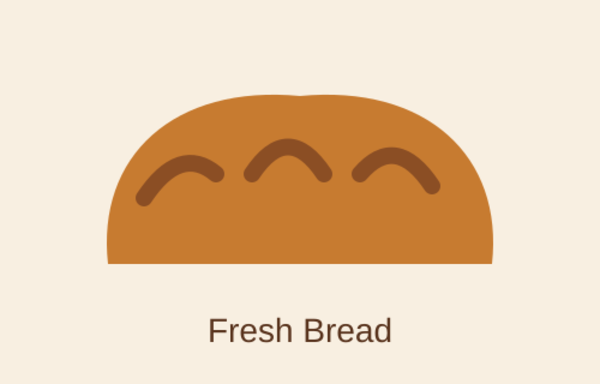

# Ubuntu Bakery - WEDE5020 Part 2

## 1. Project overview

Ubuntu Bakery is a fictional small bakery established in 2021 in Limpopo, South Africa. Part 2 continues the Part 1 website and focuses on CSS styling, desktop layout, responsive design, responsive images and documentation.

The website has five linked pages:

1. Home - `index.html`
2. About Us - `about.html`
3. Products - `products.html`
4. Enquiry - `enquiry.html`
5. Contact - `contact.html`

## 2. Technologies used

- HTML5 for the page structure.
- CSS3 for styling and responsive design.
- JavaScript for basic enquiry form validation.
- Git/GitHub for version control and submission.

## 3. Part 1 feedback and Part 2 improvements

The available LMS feedback screen showed a Part 1 result of **65/100 (65%)**, but no detailed lecturer comments were visible. Therefore, no specific lecturer comments have been invented.

Part 2 improvements were made directly to the website code to meet the new requirements. The actual changes are documented below so that the lecturer can compare this README with the code.

## 4. HTML code changes

### 4.1 `index.html`

The homepage was updated with classes that are used by the external stylesheet:

- `hero` for the main introduction area.
- `button` for the Products link.
- `content-section` and `section-heading` for consistent spacing and headings.
- `grid` for the content card layout.
- `card` for the three information cards.

The page continues to use semantic elements such as `header`, `nav`, `main`, `section`, `article` and `footer`.

### 4.2 `about.html`

The main heading now uses the `page-heading` class so that it receives the same styling as the other internal pages.

The page remains linked to the external stylesheet:

```html
<link rel="stylesheet" href="css/style.css">
```

### 4.3 `products.html`

The Products page was updated with:

- `page-heading` for the main heading.
- `grid` for the product layout.
- `card` for each product.
- `<picture>` for responsive image handling.
- `srcset` and `sizes` for different image resolutions.
- `loading="lazy"` to delay loading images until needed.
- `width` and `height` attributes to help reserve image space.
- Meaningful `alt` text for accessibility.

The responsive image structure is:

```html
<picture>
  <source media="(max-width: 40rem)" srcset="assets/bread-600.png">
  
</picture>
```

The same approach is used for cupcakes and cake.

### 4.4 `enquiry.html`

The enquiry page was updated with:

- `page-heading` on the main heading.
- `form-card` on the form container.
- `button` on the submit button.
- `aria-live="polite"` on the feedback message.
- Labels connected to their form controls using `for` and `id`.
- Required fields for the main enquiry information.

### 4.5 `contact.html`

The Contact page was updated with:

- `page-heading` on the main heading.
- `grid contact-grid` for the layout.
- `contact-details`, `business-hours` and `social-media` classes for named CSS Grid areas.
- `card` styling for each information section.

## 5. External CSS stylesheet - `css/style.css`

All five HTML pages use the same external stylesheet. This avoids repeating the same CSS on every page.

### 5.1 CSS reset

A reset was added for consistent starting styles:

```css
* {
  box-sizing: border-box;
  margin: 0;
  padding: 0;
}
```

### 5.2 Base style

The base style sets the font, font size, line height, colours and background for the website. CSS variables are used for the main Ubuntu Bakery colours.

### 5.3 Typography

The stylesheet uses:

- `font-family` for the font.
- `font-size` with `rem` for relative sizing.
- `font-weight` for emphasis.
- `line-height` for readable text spacing.
- `letter-spacing` for heading appearance.

Different heading sizes are used for `h1`, `h2` and `h3`.

### 5.4 Flexbox

Flexbox is used for the navigation and card content.

The navigation uses:

```css
.navbar {
  display: flex;
  align-items: center;
  justify-content: space-between;
}
```

The card content also uses `display: flex` and `flex-direction: column`.

### 5.5 CSS Grid

The main content cards use CSS Grid:

```css
.grid {
  display: grid;
  grid-template-columns: repeat(3, minmax(0, 1fr));
  gap: 1.25rem;
}
```

The Contact page also demonstrates named Grid areas:

```css
.contact-grid {
  grid-template-areas:
    "details hours"
    "social social";
}
```

This provides a clear desktop layout and changes to a single column on mobile.

### 5.6 Visual styling

The stylesheet includes:

- `color`
- `background` and `background-color`
- `border`
- `border-radius`
- `box-shadow`
- Button styling
- Navigation styling
- Consistent spacing

### 5.7 Pseudo-classes and interaction

The website uses `:hover`, `:focus`, `:focus-visible` and `:active` to provide feedback when users interact with navigation links and buttons.

Example:

```css
.button:hover,
.button:focus,
.button:active {
  background: var(--brown);
  color: var(--white);
  transform: translateY(-0.1rem);
}
```

### 5.8 Relative units

Relative units are used to make the website more flexible. Examples include:

- `%` for widths.
- `rem` for font sizes and spacing.
- `vw` in responsive image sizing.
- `fr` for Grid columns.

### 5.9 Responsive images

The CSS ensures images do not overflow their containers:

```css
img {
  display: block;
  max-width: 100%;
  height: auto;
}
```

The HTML also uses `<picture>`, `srcset` and `sizes` on the product images.

## 6. Responsive design

The website has three main screen layouts.

### Desktop

At larger screen sizes:

- The main grid uses three columns.
- Navigation is arranged horizontally.
- The Contact page uses named Grid areas.
- Larger heading sizes are used.

### Tablet

At `56rem` and below:

- The main grid changes to two columns.
- Hero spacing and heading size are reduced.
- The layout remains easy to read on a medium-sized screen.

### Mobile

At `40rem` and below:

- The main grid changes to one column.
- Contact Grid areas become one column.
- Navigation changes to a stacked layout.
- Heading sizes are reduced.
- Form padding is reduced.
- Images remain inside their containers.

The media query is implemented in `css/style.css` rather than using separate CSS files.

## 7. JavaScript - `js/script.js`

The enquiry form uses basic JavaScript validation.

The script:

1. Finds the enquiry form.
2. Stops the normal form submission for this academic demonstration.
3. Checks whether required fields are valid.
4. Displays an error message if required information is missing.
5. Displays a success message after valid input.
6. Resets the form after successful validation.

The JavaScript is kept simple because the purpose of this Part 2 is mainly CSS styling and responsive design.

## 8. Images and assets

The bakery product illustrations from Part 1 were kept. Additional 600px and 1200px PNG versions were added so the website can demonstrate responsive image selection.

Files include:

- `assets/bread-600.png`
- `assets/bread-1200.png`
- `assets/cupcakes-600.png`
- `assets/cupcakes-1200.png`
- `assets/cake-600.png`
- `assets/cake-1200.png`
- Original SVG versions are also retained.

## 9. Testing and evidence

The code was checked for page structure, internal paths, external stylesheet links, responsive CSS features and required responsive-image markup. Final browser/device testing must be completed by the student before submission, because the lecturer requires screenshot evidence from the student's testing environment.

The following tests are required:

- All five pages load.
- All navigation links work.
- The external CSS stylesheet loads on all pages.
- Desktop uses the multi-column layout.
- Tablet changes to the two-column layout.
- Mobile changes to the single-column layout.
- Navigation stacks on mobile.
- Product images resize correctly.
- Product images contain `picture`, `srcset` and `sizes` code.
- The enquiry form rejects incomplete required information.
- The enquiry form displays a success message for valid information.
- Hover, focus and active states are present.
- There is no unwanted horizontal scrolling.

### Screenshot evidence

The final submission should contain screenshot evidence of:

1. Desktop view of the website.
2. Tablet view of the website.
3. Mobile view of the website.
4. Products page showing responsive product cards/images.
5. Enquiry page showing the form and its validation/success message.
6. Browser developer tools responsive/device view where required by the lecturer.

Screenshots should be added to this README in GitHub after the student's final browser/device testing. They should not be presented as lecturer feedback.

## 10. GitHub repository requirements

The updated code must be pushed to the remote GitHub repository.

Descriptive commits should be used instead of one vague commit. Suggested commit messages are:

- `Update HTML structure for Part 2`
- `Create external CSS stylesheet`
- `Add desktop Flexbox and Grid styling`
- `Add responsive design and breakpoints`
- `Add responsive product images`
- `Update README with Part 2 documentation`
- `Add testing evidence`

The GitHub repository link must be submitted to the Learning Management System as required by the POE.

## 11. Part 2 checklist against the brief

| Requirement | Where it is implemented/documented |
|---|---|
| External stylesheet | `css/style.css` linked from all five HTML pages |
| Consistent stylesheet naming | `css/style.css` |
| Base styling | `css/style.css` base selectors and variables |
| CSS reset | `css/style.css` reset section |
| Typography | `css/style.css` heading/body rules |
| Desktop layout | Flexbox and Grid in `css/style.css` |
| Flexbox | `.navbar` and `.card` |
| CSS Grid | `.grid` and `.contact-grid` |
| Visual styling | Colours, backgrounds, borders and shadows |
| Pseudo-classes | `:hover`, `:focus`, `:focus-visible`, `:active` |
| Breakpoints | `56rem` tablet and `40rem` mobile |
| Relative values | `%`, `rem`, `vw`, `fr` |
| Responsive images | `<picture>`, `srcset`, `sizes` and responsive CSS |
| HTML changes | All five HTML files |
| Testing | Section 9 of this README |
| Changelog | Section 12 of this README |
| References | Section 13 of this README |
| GitHub commits | Section 10 of this README |

## 12. Detailed changelog

### Part 1 to Part 2

**`index.html`**
- Added classes for the hero, content section, heading, button, grid and cards.
- These classes connect the HTML structure to the new external CSS styling.

**`about.html`**
- Added the `page-heading` class.
- Kept the page linked to the shared external stylesheet.

**`products.html`**
- Added the `page-heading`, `grid` and `card` classes.
- Added `<picture>`, `srcset`, `sizes`, lazy loading and image dimensions.
- Improved image descriptions with meaningful `alt` text.

**`enquiry.html`**
- Added `page-heading`, `form-card` and `button` classes.
- Added accessible live feedback using `aria-live`.

**`contact.html`**
- Added `page-heading` and Grid layout classes.
- Added named Grid areas for Contact Details, Business Hours and Social Media.

**`css/style.css`**
- Added CSS reset.
- Added CSS variables.
- Added typography and spacing.
- Added Flexbox.
- Added CSS Grid and named Grid areas.
- Added decorative and visual styling.
- Added hover, focus and active states.
- Added relative units.
- Added tablet and mobile media queries.
- Added responsive image styling.

**`js/script.js`**
- Retained and documented the basic enquiry form validation.

**`assets/`**
- Added 600px and 1200px PNG versions of product illustrations for responsive image use.

**`README.md`**
- Added all non-code Part 2 documentation, including design decisions, code-change explanations, testing requirements, changelog, GitHub requirements and references.

## 13. References

- World Wide Web Consortium (W3C). HTML and CSS standards. https://www.w3.org/standards/
- MDN Web Docs. HTML: HyperText Markup Language. https://developer.mozilla.org/en-US/docs/Web/HTML
- MDN Web Docs. CSS: Cascading Style Sheets. https://developer.mozilla.org/en-US/docs/Web/CSS
- MDN Web Docs. Responsive web design. https://developer.mozilla.org/en-US/docs/Learn_web_development/Core/CSS_layout/Responsive_Design
- MDN Web Docs. Responsive images. https://developer.mozilla.org/en-US/docs/Web/HTML/Guides/Responsive_images
- MDN Web Docs. CSS Grid Layout. https://developer.mozilla.org/en-US/docs/Web/CSS/Guides/Grid_layout
- MDN Web Docs. CSS Flexible Box Layout. https://developer.mozilla.org/en-US/docs/Web/CSS/Guides/Flexible_box_layout


## 14. Screenshots of the website

1. Desktop Screenshots

  


2. Mobile Screenshots

 


